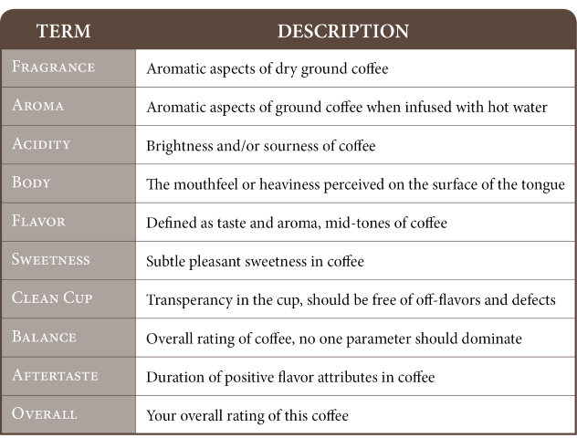
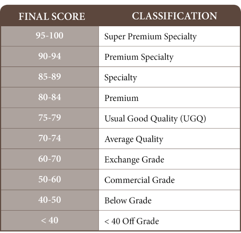
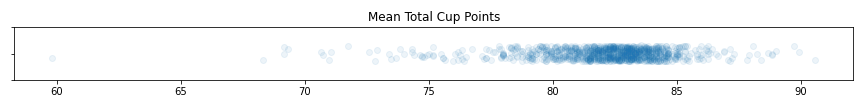
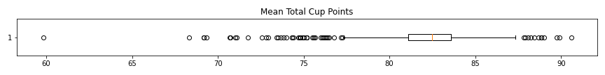
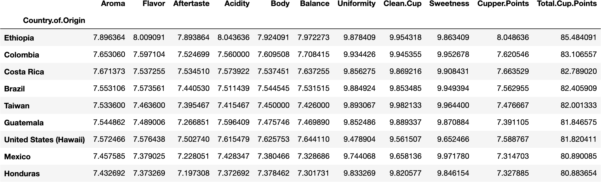
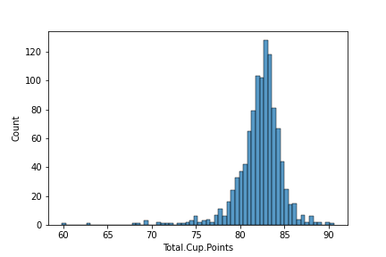
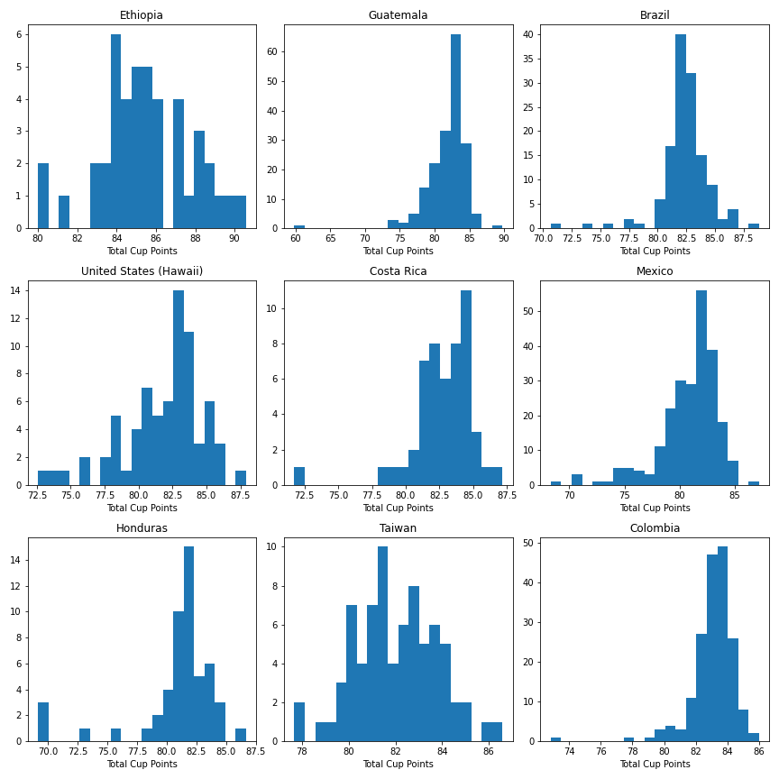
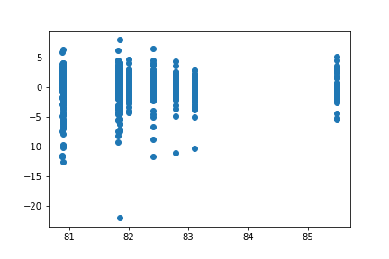
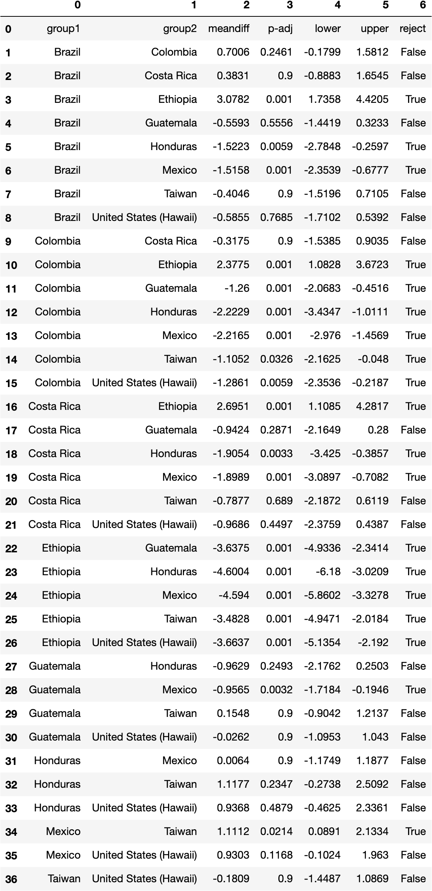
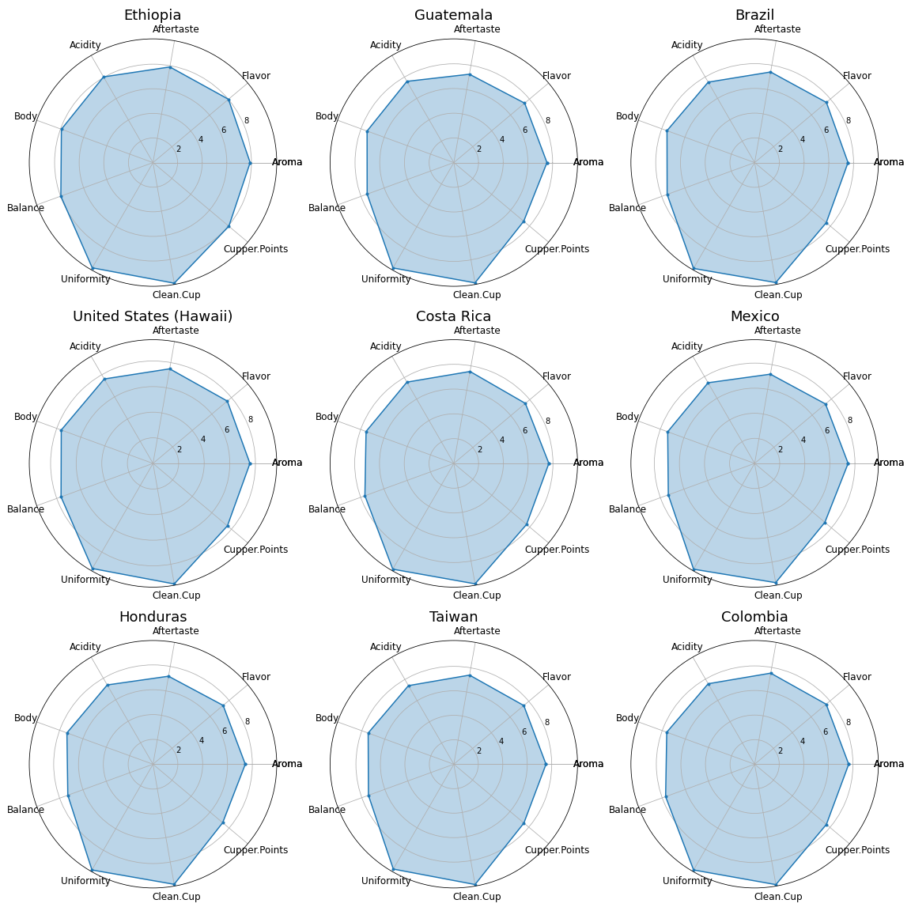

# Where does the best covfefe come from?
As a former barista and avid coffee drinker, I wanted to see if there was a particular region in the world that produces a higher quality coffee than the rest. This project is broken down into three parts:
- data requisition
- initial EDA
- comparisons of coffees by region (country)
- bonus: what do differnt countries' coffee look like?

---

## Background

There are a few terms throughout this analysis that require some introduction, such as "Cupping Points". Below are a couple tables to give a little context into the study and the metric of coffee quality we'll be exploring. 

Another graphic I found useful in drawing conclusions was a breakdown of what Cupping Points meant and identified: 

---

## Data Requisition

The data used comes from [Coffee Quality Institute](https://www.coffeeinstitute.org), scraped by github user [jldbc](https://github.com/jldbc), who graciously cleaned and left his scripts for the public to use. His data and source code can be found [here](https://github.com/jldbc/coffee-quality-database). As this dataset was created in 2018, I attempted to use his script to scrape more current data, but it seems the Coffee Institute's webiste is a little different now than it was in 2018. I didn't have too much time to spend adjusting the script as a good chunk was hard-coded, so I've just used his provided data as is.

---

## Initial EDA

I decided to look specifically at the arabica species of coffee beans, as they produce the most grown, sold, and drunk coffee around the world. Another thing to note is the data used for this project was filtered by the number of coffee samples grouped by country. I chose to work with countries who had at least 40 samples (40 chosen arbitrarily), effectively giving us the top nine most sampled countries. 

Upon closer inspection of these countries, I realized that this dataset is not representative of the world's coffee production, with Vietnam, the world's second largest coffee producer and exporter, being completely absent. With that being said, conclusions drawn from this dataset should be taken with a grain of salt. 

We begin with a simple scatter and boxplot of the dataset's mean Total Cupping Points. 
 
  
Here is a summary of the charts above: 

count   1027.000000  
mean      82.086514  
std        2.691199 

min       59.830000  
25%       81.080000  
50%       82.500000  
75%       83.580000  
max       90.580000  

We can see here the vast majority of our samples lie from 80-85. If we refer to our coffee classification chart above, we see that we're dealing mostly with premium coffees. For some context, many of Starbucks' coffees are considered a grade below, in the high 70s.

__Cupping Scores grouped by Country__

The table above shows our top nine countries and their mean cupping scores, ordered by their total score, in descending order.  
From what we can see, it looks as if Ethiopian coffees are a step above the rest, but can we truly say that, from a statistical standpoint?

---

## Comparision of Covfefes by Country

When we look at the average Total Points of each country, we intuitively rank each country by their average Total Points from highest to lowest. But statistically speaking, we can't infer significance by simply looking at their averages. I've made a table of a ranking of sorts, but before I get there, I want to outline the process:

1. check distribution of Total Cup Points
2. check distribution of Total Cup Points of specific countries
3. fit linear regression model for Total Cup Points ~ Country
4. perform pairwise group comparison 

What this gives us is a comparison of countries in which we can say are "grouped" or whose total cup points are similar. 

### 1. Check distribution of Total Cup Points

Fairly straight-forward. I wanted to check and be sure that our Total Cup Points tend towards a normal distribution.  
  
As we can see here, it does.

### 2. Check distribution of Total Cup Points of specific countries

The idea here is the same as the previous, just broken down into our specific top nine countries. I want to be sure we're applying our linear regression model to an valid sample.  

### 3. Fit linear regression model

Using the `statsmodel` package, I've created and fit the model setting Total Cup points as the dependent variable, then plotted those values against its residuals.

### 4. Perform pairwise group comparison

Finally, using the model previously created, I performed a pairwise group comparison of each country against each other.  

By distilling the table above into a more readable format of relatable Conutries, we get the following table:

| Mean Points | Country     |   |   |   |   |   |   |   |
|-------------|-------------|---|---|---|---|---|---|---|
| 85.28       | Ethiopia    | A |   |   |   |   |   |   |
| 82.79       | Brazil      |   | B |   |   |   |   |   |
| 83.11       | Columbia    |   | B | C |   |   |   |   |
| 82.41       | Costa Rica  |   | B | C | D |   |   |   |
| 80.88       | Guatemala   |   | B |   | D | E |   |   |
| 80.89       | Hounduras   |   | B |   | D | E | F |   |
| 81.82       | US (Hawaii) |   | B |   | D | E | F | G |
| 82.00       | Taiwan      |   | B |   | D | E | F | G |
| 81.45       | Mexico      |   |   |   |   |   | F |   |

What we have here is a ranking, of sorts. Each letter designates a group of similarity. While this doesn't exactly give us ranking system, it allows us to compare the means of countries who are in different groups. That being said, we can conclude that Ethiopia, being in a group of it's own and also with the highest mean Total Cup Points is statistically of a higher quality than the rest.

---

## Bonus: What do different countries' covfefes look like?

I plottted out each country's mean cupping points, broken down into the seperate grading categories that make up the Total Cup Point.  
In a way, this gives us a visual of what the coffees look like.

When we compare the average Total Cup Points of each country and the charts above, it shouldn't be surprising that they look almost the same, as their averages are also fairly similar. I believe if we had taken a larger sample with more variance in the average Total Cup Points, we would begin to see the change.

## Conclusion

As stated previously, we don't have a full representative sample of all the different regions in which coffee is grown and produced, and we're only working with mostly "premium" coffees. However, we are still able to draw some conclusions from what is available to us. Ethiopia looks to be the highest quality coffee producer in this dataset and by inductive reasoning, the next time you go to Starbucks and see single origin coffee being served, pick Ethiopian!
